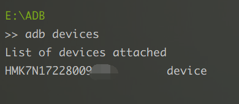

# wechat-jump-helper 

1. 准备工作
    - PHP7+

    - 下载 [ADB工具](https://dl.google.com/android/repository/platform-tools-latest-windows.zip) 并解压

    - 将 Android 设备连接上计算机，并打开 USB调试选项

    - 命令行进入ADB工具目录，通过 adb devices 命令验证是否连接上Android设备

      


2. 运行程序
    - 修改 src/Config.php 中部分参数，如ADB、TEMP_PATH等

    - 打开微信跳一跳，命令行中执行

      ``` shell
        php -f jump.php
      ```


3. 其它
    
    - 当程序无法达到预期时，根据你的情况适当修改 src/Config.php 中部分参数


